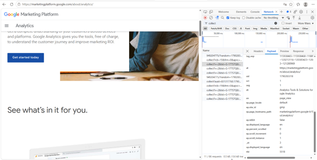

# Домашняя работа № 1 · Путь данных от ссылки до заявки

**Дисциплина:** ОП.03 «Информационные технологии»

| Поле | Значение |
|---|---|
| Фамилия, имя, отчество | Суетнова Арина Евгеньевна |
| Группа | РПО 26/1 |
| Номер работы | 1 |
| Тема работы | Цифровая воронка: путь данных от ссылки до заявки |
| Дата сдачи | 24.09.2026 |
| Ветка | hw-01 |

## Задание

1. Открыть сайт, панель разработчика (F12) → Network, в фильтре `collect`, галочка **Preserve log**.
2. Сделать три действия: обновить страницу, прокрутить до низа, нажать на товар. Записать, какие события ушли — параметр `en` на вкладке **Payload**.
3. Описать путь пользователя от ссылки до заявки, пять шагов.
4. Найти одно место на этом пути, где данные могут потеряться.
5. Приложить скриншоты `screens/01-network.png` и `screens/02-payload.png`.

## 1. Какой сайт смотрела

| Поле | Значение |
|---|---|
| Название сайта | Google Merch Shop |
| Адрес | [https://shop.merch.google/](https://marketingplatform.google.com/about/](https://marketingplatform.google.com/about/analytics/)) |
| Откуда сайт | свой не из списка |

## 2. Три действия и что отправил счётчик

| № | Что я сделала на сайте | Название события (en) | Что ещё было в Payload |
|---|---|---|---|
| 1 | обновил страницу | page_view | dl, dt, tid |
| 2 | прокрутила до низа | scroll | percent_scrolled, dl |
| 3 | нажала на товар | click / select_item | link_url, link_text |

Скриншоты:

## 3. Путь пользователя: 5 шагов

| № | Мой шаг |
|---|---|
| 1 | человек увидел ссылку на Google Marketing Platform и кликнул |
| 2 | открылась главная страница сервиса с описанием Analytics |
| 3 | начал читать про возможности GA4 |
| 4 | прокрутил страницу до блока с призывом |
| 5 | нажал «Get started today» и перешёл к регистрации в Google Analytics |

## 4. Где данные могут потеряться

| № | На каком шаге | Что может потеряться |
|---|---|---|
| 1 | шаг 3, прокрутка страницы | событие scroll не уходит, потому что пользователь не доскроллил до 90%, и в аналитике не видно интереса |
