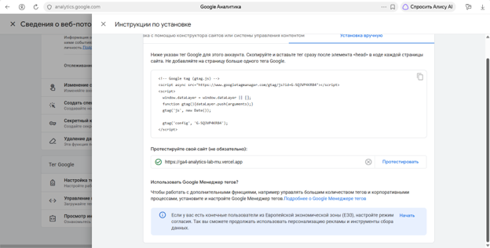
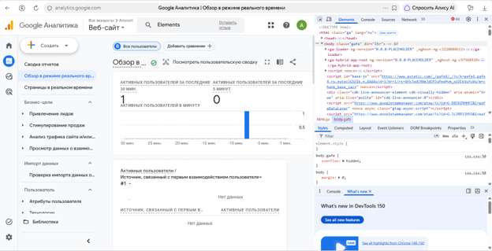
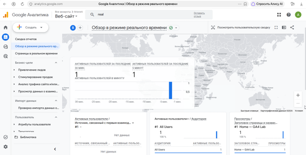
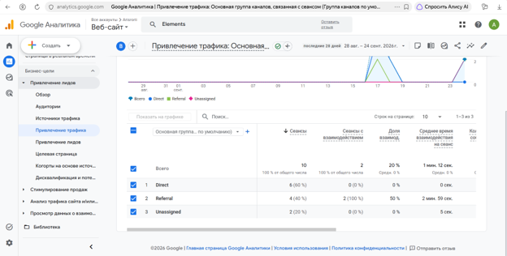
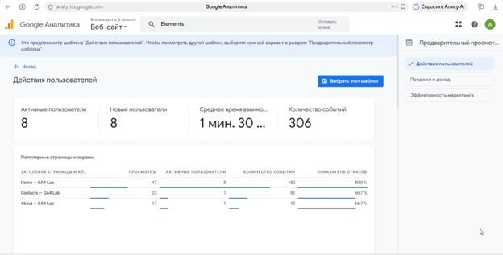

# Домашняя работа № 3 · Тег на сайте, источник и отчёты GA4

**Дисциплина:** ОП.03 «Информационные технологии»

| Поле | Значение |
|---|---|
| Фамилия, имя, отчество | Суетнова Арина Евгеньевна |
| Группа | РПО 26/1 |
| Номер работы | 3 |
| Тема работы | Установка Google Tag, источник перехода и отчёты GA4 |
| Дата сдачи | 25.09.2026 |
| Ветка | hw-03 |

## 1. Мой сайт и мой ресурс

| Поле | Значение |
|---|---|
| Адрес репозитория сайта | (https://github.com/Aristorii/ga4-analytics-lab) |
| Публичный адрес сайта | https://ga4-analytics-lab-mu.vercel.app |
| Статус публикации | READY |
| Analytics Account | Arisorii (ID 407462850) |
| Property | Веб-сайт (ID 553566833) |
| Stream name | GA4 Analytics Lab — Arina |
| Website URL в потоке | https://ga4-analytics-lab-ivanov.vercel.app |
| Measurement ID (G-…) | G-SQ3VP4KR84 |
| Страницы с тегом | Главная (Home — GA4 Lab) |

## 2. Тег установлен

Результат проверки из инструкции тега: тег Google обнаружен, зелёная галочка «Сбор данных работает в течение последних 48 часов».

## 3. События доходят до аналитики

| Поле | Значение |
|---|---|
| Дата и время проверки | 25.09.2026, около 23:50 |
| Какие страницы открывали | Главная страница (Home — GA4 Lab) |
| Какие события появились в Realtime | first_visit, page_view, scroll, session_start |
| Число активных пользователей в момент проверки | 1 |

## 4. Источник перехода определился

Ссылка целиком:

https://ga4-analytics-lab-ivanov.vercel.app/?utm_source=vk&utm_medium=social&utm_campaign=dz3

| Поле | Значение |
|---|---|
| Где в GA4 виден источник | Отчёты → Привлечение → Приобретение трафика |
| Какое значение источника показал GA4 | Referral (4 сеанса) |
| Совпадает с utm_source из ссылки | нет — GA4 отнёс переход к группе Referral, точный источник vk/social в этом отчёте не отображается |

## 5. Статистика на странице «Отчёты»

| Показатель | Значение | Период |
|---|---|---|
| Пользователи | 8 | Последние 28 дней |
| Сеансы | 10 | Последние 28 дней |
| События | 306 | Последние 28 дней |
| Самое частое событие | page_view | Последние 28 дней |

**Что видно по этим числам:** за 28 дней на сайт зашли 8 пользователей, которые совершили 306 событий — в среднем около 38 событий на пользователя. Самое частое событие — page_view, что говорит о базовом интересе к страницам. Наибольший интерес вызвала главная страница (47 просмотров), но показатель отказов там высокий (80%) — возможно, пользователи не находят нужную информацию сразу.

## 6. Что не получилось

Все шаги выполнены. На сайте в коде обнаружены теги Google Analytics, сбор данных идёт в реальном времени.

## 7. Использование ИИ

| Вопрос | Ответ |
|---|---|
| Что сделано самостоятельно | Установила тег на сайт, проверила обнаружение через инструкцию GA4, сняла скриншоты Realtime, открыла сайт с UTM-метками, проверила события и все остальное |
| Что спрошено у модели | ничего |
| Что после этого изменено | ничего |
